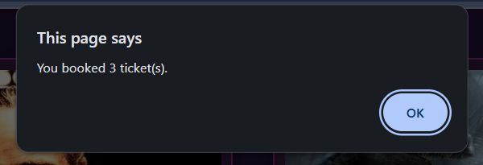

# Web Cinema Simulation

Web Cinema Simulation is a fully functional web application built with Python (Flask), HTML, CSS, JavaScript, and SQLite.
It simulates a small online cinema system, where users can view available movies, check details, and book tickets through an interactive and dynamic web interface.

The project demonstrates the integration of backend logic, database management, and frontend interactivity using Flask as the core framework.

## Project Structure

## Core Features

### Movie List Interface

Displays all available movies with details such as title, description, ticket price, and poster image.
Users can easily scroll through the list to explore movies currently available.

### Ticket Booking System

Users can select a movie, enter the number of seats, and book tickets.
After booking, the system shows confirmation messages — first displaying the number of seats booked, then the total price paid.

 

After pressing the “Book” button:

 

### Database Integration

All data is stored in an SQLite database, including:

Movie details (title, description, image, price)

Available seats

Booked tickets

No external database tools (like DBeaver) are required — everything runs locally and automatically updates in real time.

### Dynamic Frontend

The frontend is built with HTML, CSS, and JavaScript, ensuring smooth interaction between user actions and backend logic.
Movie elements are dynamically generated from backend data and displayed with real-time updates.

 

After clicking on the selected movie:

### Flask Backend

Flask handles:

Routing between pages

Serving dynamic content

Managing form submissions

Interacting with the SQLite database

### Final Web Application

## Learning Focus

This project was designed as a practical example to combine backend and frontend development into one coherent system.

You’ll find examples of:

Using Flask for backend web logic

Managing data via SQLite

Enhancing interactivity using JavaScript

Styling interfaces with CSS for a pleasant user experience

## Technologies Used

Python (Flask) – backend web framework

HTML5 / CSS3 / JavaScript – frontend development

SQLite – lightweight local database
